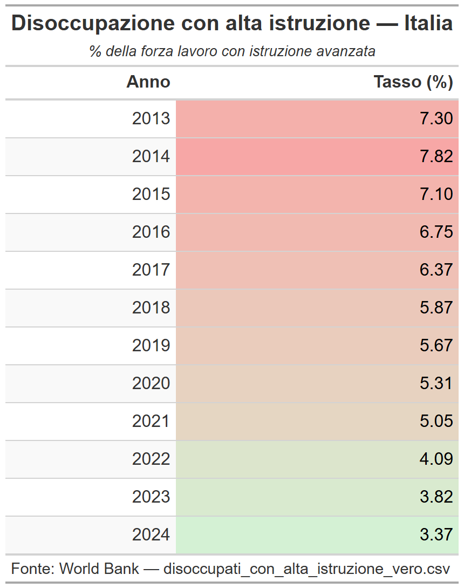

# Obiettivo principale 
\setbeamertemplate{footline}{}
\begin{block}{}
\Large
Selezionare, analizzare e sviluppare i dati del dataset sui flussi migratori per identificare tendenze di emigrazione e motivazioni significative che possano essere utili per comprendere come si sviluppa la fuga di cervelli dall'Italia verso i Big 5 europei e altri maggiori poli d'emigrazione nel mondo.
\end{block}

---

# Analisi della situazione economica e migratoria in Italia - Disoccupazione
\setbeamertemplate{footline}{}
\begin{block}{}
\Large
Abbiamo analizzato i dati sui tassi di disoccupazione degli individui con alta istruzione, riscontrando in particolare un aumento significativo negli anni della pandemia, mentre da dopo la fine del 2021 si è osservata una tendenza alla diminuzione, seppur con valori ancora superiori a quelli pre-pandemici.
\end{block}


# Tabella descrittiva della disoccupazione con alta istruzione in Italia
\setbeamertemplate{footline}{}
```{r include = FALSE, fig.align='center', fig.width=7, fig.height=4.5}
# ============================================================
#  Disoccupazione con alta istruzione - Solo Italia
#  Fonte: disoccupati_con_alta_istruzione_vero.csv
# ============================================================

# Installa i pacchetti se non presenti
if (!requireNamespace("readr",  quietly = TRUE)) install.packages("readr")
if (!requireNamespace("dplyr",  quietly = TRUE)) install.packages("dplyr")
if (!requireNamespace("tidyr",  quietly = TRUE)) install.packages("tidyr")
if (!requireNamespace("gt",     quietly = TRUE)) install.packages("gt")

library(readr)
library(dplyr)
library(tidyr)
library(gt)

# ── 1. Caricamento dati ───────────────────────────────────────
df <- read_csv("disoccupati_con_alta_istruzione_vero.csv",
               show_col_types = FALSE)

# ── 2. Filtra solo l'Italia (prima riga / Country Code = ITA) ─
italia <- df |>
  filter(`Country Code` == "ITA")

# ── 3. Seleziona e riorganizza le colonne degli anni ──────────
anni_cols <- names(italia)[grepl("\\[YR", names(italia))]

italia_long <- italia |>
  select(all_of(anni_cols)) |>
  pivot_longer(
    cols      = everything(),
    names_to  = "Anno",
    values_to = "Tasso (%)"
  ) |>
  mutate(
    Anno      = sub(" \\[YR\\d+\\]", "", Anno),   # pulisce "2013 [YR2013]" → "2013"
    Anno      = as.integer(Anno),
    `Tasso (%)` = suppressWarnings(as.numeric(`Tasso (%)`))
  ) |>
  filter(!is.na(`Tasso (%)`))   # rimuove anni senza dato

# ── 4. Visualizza la tabella con {gt} ─────────────────────────
tabella <- italia_long |>
  gt() |>
  tab_header(
    title    = md("**Disoccupazione con alta istruzione — Italia**"),
    subtitle = md("*% della forza lavoro con istruzione avanzata*")
  ) |>
  cols_label(
    Anno        = "Anno",
    `Tasso (%)` = "Tasso (%)"
  ) |>
  fmt_number(
    columns  = `Tasso (%)`,
    decimals = 2
  ) |>
  data_color(
    columns = `Tasso (%)`,
    method  = "numeric",
    palette = c("#d4f1d4", "#f7a7a6")   # verde basso → rosso alto
  ) |>
  tab_style(
    style     = cell_text(weight = "bold"),
    locations = cells_column_labels()
  ) |>
  tab_source_note(
    source_note = "Fonte: World Bank — disoccupati_con_alta_istruzione_vero.csv"
  ) |>
  opt_table_font(font = "Arial") |>
  opt_row_striping()

# Mostra la tabella nel Viewer di Positron
print(tabella)

library(gt)

gtsave(tabella, "tabella.png")
```

```{r fig.align='center', fig.width=7, fig.height=4.5}

```

# Analisi della situazione economica e migratoria in Italia - Migrazione
\begin{block}{}
\Large
Analogamente al tasso di disoccupazione, nel tempo, si è verificato un aumento dei flussi migratori, con un picco durante la pandemia, seguito da una leggera diminuzione negli ultimi anni, ma con valori ancora superiori a quelli pre-pandemici.
\end{block}

# Grafico a barre dei flussi migratori dall'Italia verso l'estero
\setbeamertemplate{footline}{}
```{r, fig.align='center', fig.width=7, fig.height=4.5}
# Grafico a barre per trasferimento di italiani con alta istruzione all'estero

library(tidyverse)
library(readxl)
library(ggplot2)

# ── 1. Lettura del file ────────────────────────────────────────────────────────
percorso_file <- "tavola12_serie_istr.xlsx"

raw <- read_excel(percorso_file, sheet = "Tavola12", col_names = FALSE)

# ── 2. Estrazione riga 26 – Totale ISCRIZIONI, colonna "alto" ─────────────────
# Struttura colonne per ogni anno (gruppi di 4):
# col 2 = basso, col 3 = medio, col 4 = alto, col 5 = totale  → anno 2013
# col 6 = basso, col 7 = medio, col 8 = alto, col 9 = totale  → anno 2014
# ...ecc. (la colonna "alto" è sempre la 3a di ogni gruppo di 4)

anni     <- 2013:2024
cols_alto <- 2 + (seq_along(anni) - 1) * 4 + 2  # col 4, 8, 12, 16, ...

riga26   <- as.numeric(raw[26, cols_alto])

dati <- tibble(
  anno  = anni,
  n     = riga26
)

# ── 3. Grafico a barre ────────────────────────────────────────────────────────
ggplot(dati, aes(x = factor(anno), y = n)) +
  geom_col(fill = "#378ADD", width = 0.7) +
  geom_text(
    aes(label = scales::label_number(big.mark = ".", decimal.mark = ",")(n)),
    vjust = -0.5,
    size  = 3.2,
    color = "grey30"
  ) +
  scale_y_continuous(
    labels   = scales::label_number(big.mark = ".", decimal.mark = ","),
    limits   = c(0, max(dati$n) * 1.12),
    expand   = expansion(mult = c(0, 0))
  ) +
  labs(
    title    = "Italiani con alta istruzione iscritti all'estero – Totale",
    subtitle = "Tavola 12 ISTAT · Riga Totale ISCRIZIONI · Colonna istruzione alta · Anni 2013–2024",
    caption  = "Fonte: ISTAT – Demo.istat.it, Tavola 12 (2024 provvisorio)",
    x        = NULL,
    y        = "Numero di persone (istruzione alta)"
  ) +
  theme_minimal(base_size = 13) +
  theme(
    plot.title      = element_text(face = "bold", size = 15, margin = margin(b = 4)),
    plot.subtitle   = element_text(colour = "grey40", size = 10, margin = margin(b = 12)),
    plot.caption    = element_text(colour = "grey55", size = 9,  margin = margin(t = 10)),
    axis.text.x     = element_text(size = 11),
    panel.grid.major.x = element_blank(),
    panel.grid.minor   = element_blank(),
    plot.margin     = margin(16, 16, 12, 16)
  )
```


# Analisi dei flussi migratori - Paesi di destinazione 
\begin{block}{}
\Large
Analisi dei flussi migratori visualizzata attraverso un diagramma cartesiano che valuta le iscrizioni di residenze dall'Italia verso i paesi di considerazione.
\end{block}

# Grafico dei flussi migratori per anno e paese di destinazione
\setbeamertemplate{footline}{}
```{r, fig.align='center', fig.width=7, fig.height=4.5}
# Grafico a linee per iscrizioni di italiani con alta istruzione all'estero

library(tidyverse)
library(readxl)

# ── 1. Lettura del file ────────────────────────────────────────────────────────
# Modifica il percorso con quello reale sul tuo computer
percorso_file <- "tavola12_serie_istr.xlsx"

raw <- read_excel(percorso_file, sheet = "Tavola12", col_names = FALSE)

# ── 2. Identificazione delle sezioni ──────────────────────────────────────────
# Il foglio ha due sezioni: ISCRIZIONI e CANCELLAZIONI
# Troviamo le righe di intestazione di ciascuna sezione
riga_iscrizioni   <- which(apply(raw, 1, function(r) any(grepl("^ISCRIZIONI$",   r, ignore.case = TRUE))))
riga_cancellazioni <- which(apply(raw, 1, function(r) any(grepl("^CANCELLAZIONI$", r, ignore.case = TRUE))))

anni <- 2013:2024

# ── 3. Funzione per estrarre una sezione ──────────────────────────────────────
estrai_sezione <- function(df, riga_inizio, riga_fine = nrow(df)) {
  # Dati: le righe tra l'intestazione ISCRIZIONI/CANCELLAZIONI e la riga Totale
  blocco <- df[(riga_inizio + 1):(riga_fine - 1), ]

  # Rimuovi la riga "Totale" se presente
  blocco <- blocco[!grepl("^totale$", blocco[[1]], ignore.case = TRUE), ]
  # Rimuovi righe con NA nella colonna paese
  blocco <- blocco[!is.na(blocco[[1]]) & nchar(trimws(blocco[[1]])) > 0, ]

  # Colonne: 1 = paese, poi gruppi di 4 (basso, medio, alto, totale) per ogni anno
  paesi <- trimws(blocco[[1]])

  # Per ogni anno estraiamo la colonna "alto" (posizione 3 di ogni gruppo di 4)
  # Le colonne iniziano dalla 2 (col 2 = basso 2013, 3 = medio 2013, 4 = alto 2013, 5 = totale 2013, ...)
  alto_cols <- 2 + (seq_along(anni) - 1) * 4 + 2  # col 4, 8, 12, ... (1-indexed: 4,8,12,...)

  mat <- blocco[, alto_cols, drop = FALSE]
  mat <- mutate_all(as.data.frame(mat), as.numeric)

  colnames(mat) <- anni
  mat$paese <- paesi

  pivot_longer(mat, cols = -paese, names_to = "anno", values_to = "n") |>
    mutate(anno = as.integer(anno)) |>
    filter(!is.na(n))
}

# ── 4. Estrazione dati ─────────────────────────────────────────────────────────
# Riga intestazione anni è subito sopra ISCRIZIONI → saltiamo quella
# La sezione ISCRIZIONI va da riga_iscrizioni+1 fino a riga della seconda intestazione anni
# che si trova subito prima di CANCELLAZIONI
riga_sep <- riga_cancellazioni - 2  # riga intestazione anni intermedia

iscrizioni    <- estrai_sezione(raw, riga_iscrizioni,    riga_fine = riga_sep) |> mutate(tipo = "Iscrizioni")
cancellazioni <- estrai_sezione(raw, riga_cancellazioni, riga_fine = nrow(raw)) |> mutate(tipo = "Cancellazioni")

dati <- bind_rows(iscrizioni, cancellazioni)

# ── 5. Paesi principali da mostrare ───────────────────────────────────────────
# Selezioniamo i top 7 per totale iscrizioni (dove vanno gli italiani)
top_paesi <- iscrizioni |>
  group_by(paese) |>
  summarise(totale = sum(n, na.rm = TRUE)) |>
  filter(!grepl("altri|totale", paese, ignore.case = TRUE)) |>
  slice_max(totale, n = 12) |>
  pull(paese)

dati_filt <- dati |>
  filter(tipo == "Iscrizioni", paese %in% top_paesi) |>
  mutate(paese = factor(paese, levels = top_paesi))

# ── 6. Palette e tipi di linea ─────────────────────────────────────────────────
n_paesi  <- length(top_paesi)
palette  <- setNames(
  c("#378ADD","#D85A30","#1D9E75","#D4537E","#BA7517","#7F77DD", "#C0C0C0", "#dfe44f", "#ff7f00", "#9467bd", "#8c564b", "#e377c2")
  [seq_len(n_paesi)],top_paesi)
tipi_linea <- setNames(
  rep(c("solid","dashed","dotted"), length.out = n_paesi),
  top_paesi
)

# ── 7. Grafico ─────────────────────────────────────────────────────────────────
ggplot(dati_filt, aes(x = anno, y = n, colour = paese, linetype = paese)) +
  geom_line(linewidth = 0.9) +
  geom_point(size = 2.2) +
  annotate("rect",
           xmin = 2019.5, xmax = 2021.5, ymin = -Inf, ymax = Inf,
           fill = "#d90429", alpha = 0.06) +
  annotate("text", x = 2020.5, y = max(dati_filt$n, na.rm = TRUE) * 0.97,
           label = "Covid-19", size = 3, colour = "#d90429", fontface = "bold") +
  # --- Fascia Brexit ---
  annotate("rect",
           xmin = 2016.5, xmax = 2019.5, ymin = -Inf, ymax = Inf,
           fill = "#00247D", alpha = 0.04) + # Un blu molto trasparente
  annotate("text", x = 2018.5, y = max(dati_filt$n, na.rm = TRUE) * 0.97,
           label = "Brexit", size = 3, colour = "#00247D", fontface = "bold") +
  scale_colour_manual(values = palette) +
  scale_linetype_manual(values = tipi_linea) +
  scale_x_continuous(breaks = 2013:2024) +
  scale_y_continuous(
    labels = scales::label_number(big.mark = ".", decimal.mark = ","),
    limits = c(0, NA),
    expand = expansion(mult = c(0, 0.06))
  ) +
  labs(
    title    = "Dove vanno gli italiani con alta istruzione",
    subtitle = "Iscritti per trasferimento di residenza all'estero · Istruzione alta · per paese di destinazione",
    caption  = "Fonte: ISTAT – Demo.istat.it, Tavola 12 (2024 provvisorio)",
    x        = NULL,
    y        = "Numero di italiani emigrati con alta istruzione",
    colour   = NULL,
    linetype = NULL
  ) +
  theme_minimal(base_size = 13) +
  theme(
    plot.title        = element_text(face = "bold", size = 15, margin = margin(b = 4)),
    plot.subtitle     = element_text(colour = "grey40", size = 11, margin = margin(b = 12)),
    plot.caption      = element_text(colour = "grey55", size = 9,  margin = margin(t = 10)),
    legend.position   = "bottom",
    legend.key.width  = unit(1.8, "cm"),
    axis.text.x       = element_text(angle = 45, hjust = 1, size = 10),
    panel.grid.minor  = element_blank(),
    panel.grid.major.x = element_line(colour = "grey90"),
    plot.margin       = margin(16, 16, 12, 16)
  ) +
  guides(colour   = guide_legend(nrow = 2),
         linetype = guide_legend(nrow = 2))

# ── 8. Salvataggio (opzionale) ─────────────────────────────────────────────────
ggsave("istat_tavola12_alta_istruzione.png", width = 10, height = 6.5, dpi = 200)
```

# Modello di regressione panel 

# Analisi descrittiva dei fattori causali
\begin{block}{}
\Large
I regressori della variabile dipendente (fuga di cervelli) sono stati identificati in:
\begin{itemize}
  \item Crescita del PIL pro capite
  \item Disugualianza (indice di Gini)
  \item Disoccupazione genereale 
\end {itemize}

Per ognuno di questi fattori, è stata condotta un'analisi descrittiva per evidenziare le tendenze e le correlazioni con i flussi migratori.
\end{block}

# Grafico dell'indice di Gini - Disugualianza
\setbeamertemplate{footline}{}
```{r fig.align='center', fig.width=7, fig.height=4.5}
library(tidyverse)

# 1. Caricamento (usiamo check.names=FALSE per mantenere gli spazi nei nomi colonne)
df1 <- read.csv("Indicatori GIni, DIsoccuazione, GDP, GDP Pro Capite ecc World Data Bank.csv", 
                check.names = FALSE, 
                na.strings = "..")

# Funzione di filtraggio e pulizia
prepara_tabella <- function(data, codice_indicatore) {
  data %>%
    # Usiamo trimws per rimuovere eventuali spazi bianchi invisibili
    filter(trimws(`Series Code`) == codice_indicatore) %>%
    select(`Country Name`, starts_with("20")) %>%
    # Puliamo i nomi delle colonne anni (es. "2013 [YR2013]" -> "2013")
    rename_with(~str_extract(., "\\d{4}"), starts_with("20"))
}

# 2. Creazione delle tabelle con i codici corretti trovati nel TUO file
tabella_gini           <- prepara_tabella(df1, "SI.POV.GINI")
tabella_disoccupazione <- prepara_tabella(df1, "SL.UEM.TOTL.NE.ZS")

# Nota: Questi nel tuo file sono la CRESCITA % annua, non il valore totale
tabella_crescita_pil          <- prepara_tabella(df1, "NY.GDP.MKTP.KD.ZG")
tabella_crescita_pil_procapite <- prepara_tabella(df1, "NY.GDP.PCAP.KD.ZG")

```


```{r fig.align='center', fig.width=7, fig.height=4.5}
library(tidyverse)

# Funzione per creare i grafici in modo automatico
crea_grafico <- function(tabella, titolo, label_y) {
  
  # Trasformiamo i dati da "larghi" a "lunghi" per ggplot
  tabella_long <- tabella %>%
    pivot_longer(cols = -`Country Name`, 
                 names_to = "Anno", 
                 values_to = "Valore") %>%
    mutate(Anno = as.numeric(sub(" \\[YR\\d+\\]", "", Anno))) # Convertiamo l'anno in numero per l'asse X

  anni_presenti <- sort(unique(tabella_long$Anno[!is.na(tabella_long$Valore)]))
  
  # Creazione del plot
  ggplot(tabella_long, aes(x = Anno, y = Valore, color = `Country Name`, group = `Country Name`)) +
    geom_line(size = 1) +
    geom_point() +
    scale_x_continuous(breaks = anni_presenti, limits = range(anni_presenti)) +
    theme_minimal() +
    labs(title = titolo, 
         x = "Anno", 
         y = label_y, 
         color = "Paese") +
    theme(legend.position = "right", 
    axis.text.x = element_text(angle = 45, hjust = 1))
}

# 1. Grafico Gini
plot_gini <- crea_grafico(tabella_gini, "Andamento Indice di Gini", "Indice (0-100)")

# 2. Grafico Disoccupazione
plot_disoccupazione <- crea_grafico(tabella_disoccupazione, "Tasso di Disoccupazione", "% Forza Lavoro")

# 3. Grafico Crescita PIL
plot_pil <- crea_grafico(tabella_crescita_pil, "Crescita Annuale del PIL", "% variazione annua")

# 4. Grafico Crescita PIL Pro Capite
plot_procapite <- crea_grafico(tabella_crescita_pil_procapite, "Crescita PIL Pro Capite", "% variazione annua")

print(plot_gini)

```

# Grafico Disoccupazione

```{r fig.align='center', fig.width=7, fig.height=4.5}
print(plot_disoccupazione)
```

# Grafico Crescita PIL pro capite

```{r fig.align='center', fig.width=7, fig.height=4.5}
print(plot_procapite)
```

# Analisi del Head Ratio - non inserito come regressore per mancanza di dati
