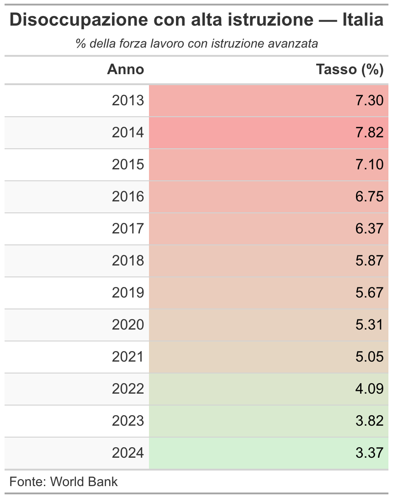

```{r setup, include=FALSE}
knitr::opts_chunk$set(
  echo    = FALSE,
  warning = FALSE,
  message = FALSE,
  fig.align = "center"
)
```

---

## Obiettivo

Selezionare, analizzare e sviluppare i dati del dataset sui flussi
migratori per identificare tendenze di emigrazione e motivazioni
significative che possano essere utili per comprendere come si sviluppa
la **fuga di cervelli** dall'Italia verso i Big 5 europei e altri
maggiori poli d'emigrazione nel mondo.

---

## Analisi della situazione economica e migratoria in Italia — Disoccupazione

Abbiamo analizzato i dati sui tassi di disoccupazione degli individui
con **alta istruzione**, riscontrando in particolare un aumento
significativo negli anni della pandemia, mentre da dopo la fine del 2021
si è osservata una tendenza alla diminuzione, seppur con valori ancora
superiori a quelli pre-pandemici.

---

## Tabella descrittiva della disoccupazione con alta istruzione in Italia

```{r tabella-disoccupazione, fig.height=2}
library(readr)
library(dplyr)
library(tidyr)
library(gt)

# Caricamento dati
df <- read_csv("disoccupati_con_alta_istruzione_vero.csv",
               show_col_types = FALSE)

# Filtra solo l'Italia
italia <- df |> filter(`Country Code` == "ITA")

# Seleziona e riorganizza le colonne degli anni
anni_cols <- names(italia)[grepl("\\[YR", names(italia))]

italia_long <- italia |>
  select(all_of(anni_cols)) |>
  pivot_longer(
    cols      = everything(),
    names_to  = "Anno",
    values_to = "Tasso (%)"
  ) |>
  mutate(
    Anno        = sub(" \\[YR\\d+\\]", "", Anno),
    Anno        = as.integer(Anno),
    `Tasso (%)` = suppressWarnings(as.numeric(`Tasso (%)`))
  ) |>
  filter(!is.na(`Tasso (%)`))

# Crea e salva la tabella come PNG (gt non renderizza in PDF nativamente)
tabella <- italia_long |>
  gt() |>
  tab_header(
    title    = md("**Disoccupazione con alta istruzione — Italia**"),
    subtitle = md("*% della forza lavoro con istruzione avanzata*")
  ) |>
  cols_label(
    Anno        = "Anno",
    `Tasso (%)` = "Tasso (%)"
  ) |>
  fmt_number(columns = `Tasso (%)`, decimals = 2) |>
  data_color(
    columns = `Tasso (%)`,
    method  = "numeric",
    palette = c("#d4f1d4", "#f7a7a6")
  ) |>
  tab_style(
    style     = cell_text(weight = "bold"),
    locations = cells_column_labels()
  ) |>
  tab_source_note(
    source_note = "Fonte: World Bank — disoccupati_con_alta_istruzione_vero.csv"
  ) |>
  opt_table_font(font = "Arial") |>
  opt_row_striping()

gtsave(tabella, "tabella_disoccupazione.png")

```

---

## Analisi della situazione economica e migratoria in Italia — Migrazione

Analogamente al tasso di disoccupazione, nel tempo, si è verificato un
aumento dei **flussi migratori**, con un picco durante la pandemia,
seguito da una leggera diminuzione negli ultimi anni, ma con valori
ancora superiori a quelli pre-pandemici.

---

## Grafico a barre dei flussi migratori dall'Italia verso l'estero

```{r grafico-barre-migratori, fig.width=9, fig.height=5}
library(tidyverse)
library(readxl)

percorso_file <- "tavola12_serie_istr.xlsx"
raw <- read_excel(percorso_file, sheet = "Tavola12", col_names = FALSE)

anni      <- 2013:2024
cols_alto <- 2 + (seq_along(anni) - 1) * 4 + 2   # col "alto" per ogni anno
riga26    <- as.numeric(raw[26, cols_alto])

dati <- tibble(anno = anni, n = riga26)

ggplot(dati, aes(x = factor(anno), y = n)) +
  geom_col(fill = "#378ADD", width = 0.7) +
  geom_text(
    aes(label = scales::label_number(big.mark = ".", decimal.mark = ",")(n)),
    vjust = -0.5, size = 3, color = "grey30"
  ) +
  scale_y_continuous(
    labels = scales::label_number(big.mark = ".", decimal.mark = ","),
    limits = c(0, max(dati$n, na.rm = TRUE) * 1.12),
    expand = expansion(mult = c(0, 0))
  ) +
  labs(
    title   = "Italiani con alta istruzione iscritti all'estero — Totale",
    subtitle = "Tavola 12 ISTAT · Riga Totale ISCRIZIONI · Colonna istruzione alta · Anni 2013–2024",
    caption = "Fonte: ISTAT – Demo.istat.it, Tavola 12 (2024 provvisorio)",
    x = NULL,
    y = "Numero di persone (istruzione alta)"
  ) +
  theme_minimal(base_size = 11) +
  theme(
    plot.title         = element_text(face = "bold", size = 12, margin = margin(b = 4)),
    plot.subtitle      = element_text(colour = "grey40", size = 8, margin = margin(b = 10)),
    plot.caption       = element_text(colour = "grey55", size = 7, margin = margin(t = 8)),
    axis.text.x        = element_text(size = 9),
    panel.grid.major.x = element_blank(),
    panel.grid.minor   = element_blank(),
    plot.margin        = margin(12, 12, 8, 12)
  )
```

---

## Analisi dei flussi migratori — Paesi di destinazione

Analisi dei flussi migratori visualizzata attraverso un diagramma
cartesiano che valuta le **iscrizioni di residenze** dall'Italia verso
i paesi di considerazione.

---

## Grafico dei flussi migratori per anno e paese di destinazione

```{r grafico-linee-paesi, fig.width=9, fig.height=5.2}
library(tidyverse)
library(readxl)

percorso_file <- "tavola12_serie_istr.xlsx"
raw  <- read_excel(percorso_file, sheet = "Tavola12", col_names = FALSE)

riga_iscrizioni    <- which(apply(raw, 1, function(r)
  any(grepl("^ISCRIZIONI$",    r, ignore.case = TRUE))))
riga_cancellazioni <- which(apply(raw, 1, function(r)
  any(grepl("^CANCELLAZIONI$", r, ignore.case = TRUE))))

anni <- 2013:2024

estrai_sezione <- function(df, riga_inizio, riga_fine = nrow(df)) {
  blocco <- df[(riga_inizio + 1):(riga_fine - 1), ]
  blocco <- blocco[!grepl("^totale$", blocco[[1]], ignore.case = TRUE), ]
  blocco <- blocco[!is.na(blocco[[1]]) & nchar(trimws(blocco[[1]])) > 0, ]
  paesi  <- trimws(blocco[[1]])
  alto_cols <- 2 + (seq_along(anni) - 1) * 4 + 2
  mat  <- blocco[, alto_cols, drop = FALSE]
  mat  <- mutate_all(as.data.frame(mat), as.numeric)
  colnames(mat) <- anni
  mat$paese <- paesi
  pivot_longer(mat, cols = -paese, names_to = "anno", values_to = "n") |>
    mutate(anno = as.integer(anno)) |>
    filter(!is.na(n))
}

riga_sep      <- riga_cancellazioni - 2
iscrizioni    <- estrai_sezione(raw, riga_iscrizioni,    riga_fine = riga_sep) |>
  mutate(tipo = "Iscrizioni")

top_paesi <- iscrizioni |>
  group_by(paese) |>
  summarise(totale = sum(n, na.rm = TRUE)) |>
  filter(!grepl("altri|totale", paese, ignore.case = TRUE)) |>
  slice_max(totale, n = 12) |>
  pull(paese)

dati_filt <- iscrizioni |>
  filter(paese %in% top_paesi) |>
  mutate(paese = factor(paese, levels = top_paesi))

n_paesi    <- length(top_paesi)
palette    <- setNames(
  c("#378ADD","#D85A30","#1D9E75","#D4537E","#BA7517","#7F77DD",
    "#C0C0C0","#dfe44f","#ff7f00","#9467bd","#8c564b","#e377c2")[seq_len(n_paesi)],
  top_paesi)
tipi_linea <- setNames(rep(c("solid","dashed","dotted"), length.out = n_paesi), top_paesi)

ggplot(dati_filt, aes(x = anno, y = n, colour = paese, linetype = paese)) +
  geom_line(linewidth = 0.8) +
  geom_point(size = 1.8) +
  annotate("rect",
           xmin = 2019.5, xmax = 2021.5, ymin = -Inf, ymax = Inf,
           fill = "#d90429", alpha = 0.06) +
  annotate("text", x = 2020.5, y = max(dati_filt$n, na.rm = TRUE) * 0.97,
           label = "Covid-19", size = 2.8, colour = "#d90429", fontface = "bold") +
  annotate("rect",
           xmin = 2016.5, xmax = 2019.5, ymin = -Inf, ymax = Inf,
           fill = "#00247D", alpha = 0.04) +
  annotate("text", x = 2018.0, y = max(dati_filt$n, na.rm = TRUE) * 0.97,
           label = "Brexit", size = 2.8, colour = "#00247D", fontface = "bold") +
  scale_colour_manual(values = palette) +
  scale_linetype_manual(values = tipi_linea) +
  scale_x_continuous(breaks = 2013:2024) +
  scale_y_continuous(
    labels = scales::label_number(big.mark = ".", decimal.mark = ","),
    limits = c(0, NA),
    expand = expansion(mult = c(0, 0.06))
  ) +
  labs(
    title    = "Dove vanno gli italiani con alta istruzione",
    subtitle = "Iscritti per trasferimento di residenza · istruzione alta · per paese",
    caption  = "Fonte: ISTAT – Demo.istat.it, Tavola 12 (2024 provvisorio)",
    x = NULL, y = "N. italiani emigrati (alta istruzione)",
    colour = NULL, linetype = NULL
  ) +
  theme_minimal(base_size = 10) +
  theme(
    plot.title         = element_text(face = "bold", size = 11, margin = margin(b = 3)),
    plot.subtitle      = element_text(colour = "grey40", size = 8, margin = margin(b = 8)),
    plot.caption       = element_text(colour = "grey55", size = 7, margin = margin(t = 6)),
    legend.position    = "bottom",
    legend.key.width   = unit(1.2, "cm"),
    legend.text        = element_text(size = 7),
    axis.text.x        = element_text(angle = 45, hjust = 1, size = 8),
    panel.grid.minor   = element_blank(),
    panel.grid.major.x = element_line(colour = "grey90"),
    plot.margin        = margin(10, 10, 8, 10)
  ) +
  guides(colour   = guide_legend(nrow = 3),
         linetype = guide_legend(nrow = 3))
```

---

## Modello di regressione panel

---

## Analisi descrittiva dei fattori causali

I regressori della variabile dipendente (fuga di cervelli) sono stati
identificati in:

\begin{itemize}
  \item Crescita del PIL pro capite
  \item Disuguaglianza (indice di Gini)
  \item Disoccupazione generale
\end{itemize}

---

## Gini Index — Disuguaglianza del reddito

```{r grafico-gini, fig.width=9, fig.height=5}
library(tidyverse)

df_wb <- read.csv(
  "Indicatori GIni, DIsoccuazione, GDP, GDP Pro Capite ecc World Data Bank.csv",
  check.names = FALSE,
  na.strings  = c("..", "NA", "")
)

target_countries <- c("USA","GBR","ESP","NLD","DEU","FRA","CHN","BRA","BEL","ARG","VEN")
year_cols <- grep("^\\d{4}", colnames(df_wb), value = TRUE)

df_long_wb <- df_wb %>%
  filter(`Country Code` %in% target_countries,
         `Series Name`  %in% c("Gini index",
                                "GDP growth (annual %)",
                                "Unemployment, total (% of total labor force) (national estimate)")) %>%
  select(`Country Code`, `Series Name`, all_of(year_cols)) %>%
  pivot_longer(cols = all_of(year_cols), names_to = "Year_Label", values_to = "Value") %>%
  mutate(Year  = as.integer(str_extract(Year_Label, "^\\d{4}")),
         Value = as.numeric(Value)) %>%
  filter(!is.na(Value))

country_colors <- c(
  "USA" = "#E63946", "GBR" = "#457B9D", "ESP" = "#F4A261",
  "NLD" = "#2A9D8F", "DEU" = "#264653", "FRA" = "#E9C46A",
  "CHN" = "#C0392B", "BRA" = "#27AE60", "BEL" = "#8E44AD",
  "ARG" = "#1ABC9C", "VEN" = "#D35400"
)

tema_slide <- theme_minimal(base_size = 10) +
  theme(
    plot.subtitle    = element_text(size = 8, color = "grey40"),
    plot.caption     = element_text(size = 7, color = "grey55", hjust = 1),
    legend.position  = "bottom",
    legend.title     = element_blank(),
    legend.text      = element_text(size = 7),
    legend.key.width = unit(1.2, "cm"),
    panel.grid.minor = element_blank(),
    panel.grid.major = element_line(color = "grey92"),
    axis.title.y     = element_text(size = 9, color = "grey40"),
    axis.title.x     = element_blank()
  )

df_long_wb %>%
  filter(`Series Name` == "Gini index") %>%
  ggplot(aes(x = Year, y = Value, color = `Country Code`, group = `Country Code`)) +
  geom_line(linewidth = 0.85) +
  geom_point(size = 1.6) +
  scale_color_manual(values = country_colors) +
  scale_x_continuous(breaks = seq(2013, 2024, by = 2)) +
  labs(
    subtitle = "0 = perfetta uguaglianza  |  100 = massima disuguaglianza",
    y        = "Gini Index",
    caption  = "Fonte: World Data Bank"
  ) +
  tema_slide
```


---

## GDP Growth — Crescita del PIL (annual %)

```{r grafico-gdp, fig.width=9, fig.height=5}
df_long_wb %>%
  filter(`Series Name` == "GDP growth (annual %)") %>%
  ggplot(aes(x = Year, y = Value, color = `Country Code`, group = `Country Code`)) +
  geom_hline(yintercept = 0, linetype = "dashed", color = "grey55", linewidth = 0.5) +
  geom_line(linewidth = 0.85) +
  geom_point(size = 1.6) +
  scale_color_manual(values = country_colors) +
  scale_x_continuous(breaks = seq(2013, 2024, by = 2)) +
  labs(
    subtitle = "Variazione percentuale annua del PIL a prezzi costanti",
    y        = "GDP Growth (%)",
    caption  = "Fonte: World Data Bank"
  ) +
  tema_slide
```

---

## Disoccupazione — % forza lavoro (stima nazionale)

```{r grafico-unemp, fig.width=9, fig.height=5}
df_long_wb %>%
  filter(`Series Name` == "Unemployment, total (% of total labor force) (national estimate)") %>%
  ggplot(aes(x = Year, y = Value, color = `Country Code`, group = `Country Code`)) +
  geom_line(linewidth = 0.85) +
  geom_point(size = 1.6) +
  scale_color_manual(values = country_colors) +
  scale_x_continuous(breaks = seq(2013, 2024, by = 2)) +
  labs(
    subtitle = "% della forza lavoro totale – stima nazionale",
    y        = "Disoccupazione (%)",
    caption  = "Fonte: World Data Bank"
  ) +
  tema_slide
```

---

## Analisi del Head Count Ratio — non inserito come regressore per mancanza di dati

```{r grafico-hcr, fig.width=9, fig.height=5}
library(tidyverse)
library(scales)

df_hcr <- read.csv("head_count_ratio.txt", sep = ";")

paesi_target <- c(
  "China", "Belgium", "Venezuela (Bolivarian Republic of)",
  "Netherlands", "Spain", "Argentina", "France",
  "United States of America", "Switzerland", "Brazil",
  "United Kingdom", "Germany"
)

dati_extra <- tribble(
  ~`Country.or.Area`, ~Year, ~Value,
  "Argentina",  2023, 41.7,  "Argentina",  2024, 38.1,
  "Brazil",     2022,  8.5,  "Brazil",     2023,  7.5,
  "China",      2021, 21.0,
  "Switzerland",2021, 15.8,
  "United States of America", 2023, 19.9,
  "United States of America", 2024, 20.2,
  "Spain",      2022, 20.4,
  "France",     2021, 14.5
)

df_filtrato <- df_hcr |>
  mutate(Year = as.numeric(Year), Value = as.numeric(Value)) |>
  filter(`Country.or.Area` %in% paesi_target, Year >= 2013) |>
  select(`Country.or.Area`, Year, Value)

df_completo <- bind_rows(df_filtrato, dati_extra) |>
  distinct(`Country.or.Area`, Year, .keep_all = TRUE)

etichette_paesi <- c(
  "Venezuela (Bolivarian Republic of)" = "Venezuela",
  "United States of America"           = "USA"
)

df_heat <- df_completo |>
  mutate(Year = as.integer(Year), Value = as.numeric(Value)) |>
  filter(Year >= 2013, Year <= 2024) |>
  complete(`Country.or.Area`, Year) |>
  mutate(
    Paese = recode(`Country.or.Area`, !!!etichette_paesi),
    Paese = factor(Paese, levels = sort(unique(Paese)))
  )

ggplot(df_heat, aes(x = Year, y = Paese, fill = Value)) +
  geom_tile(color = "white", linewidth = 0.5) +
  geom_text(
    aes(label = if_else(is.na(Value), "—", sprintf("%.1f", Value))),
    size = 2.8, color = "grey20"
  ) +
  scale_fill_gradientn(
    colours  = c("#D5F5E3", "#F9E79F", "#F0B27A", "#E74C3C", "#7B241C"),
    values   = rescale(c(0, 20, 40, 60, 85)),
    name     = "Tasso (%)",
    na.value = "#EFEFEF"
  ) +
  scale_x_continuous(breaks = 2013:2024, expand = c(0, 0)) +
  labs(
    title   = "Head Count Ratio — Tasso di Povertà per Paese e Anno",
    subtitle = "% popolazione sotto soglia di povertà | celle grigie = dato mancante",
    caption = "Fonte: World Bank · Eurostat · ENCOVI",
    x = NULL, y = NULL
  ) +
  theme_minimal(base_size = 9) +
  theme(
    plot.title      = element_text(face = "bold", size = 10, margin = margin(b = 3)),
    plot.subtitle   = element_text(colour = "grey40", size = 7),
    plot.caption    = element_text(colour = "grey55", size = 7),
    axis.text.x     = element_text(angle = 40, hjust = 1, size = 8),
    axis.text.y     = element_text(size = 8),
    panel.grid      = element_blank(),
    legend.position = "top",
    plot.margin     = margin(10, 10, 8, 10)
  )
```
